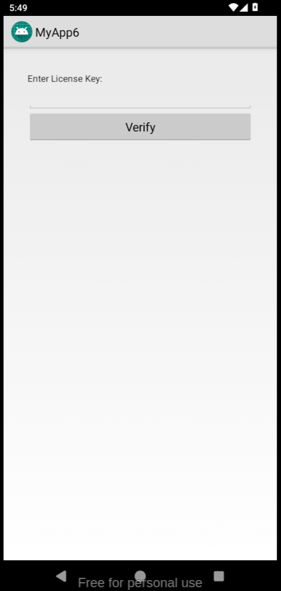
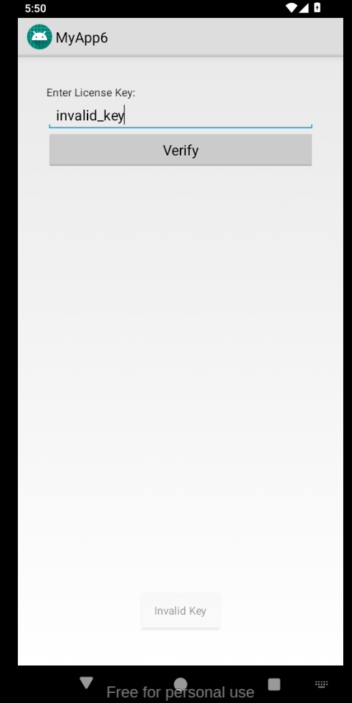
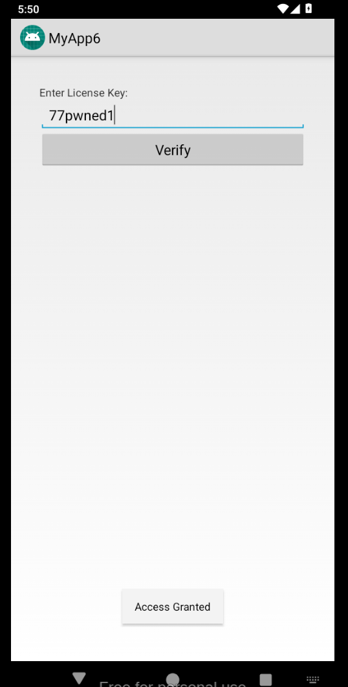

# Writeup

[Crackme Source](https://crackmes.one/crackme/69b7d857ddd6176826ae8a10)

## Setup

I used `Genymotion` to create an Android Virtual Machine, so I could safely install and test the application. I installed it from the Arch User Repository, and didn't really configure or change anything either.

In this challenge, I used `android-apktool` to extract the Android Package (APK)'s contents and `jadx` for decompiling the `.smali` files.

## Initial steps

Let's check out the description first:
```
Description: &gt; A simple Android CrackMe written entirely in Java. The UI is created programmatically without using XML layouts.
Goal: &gt; Find the correct 8-character license key to trigger the success message and reveal the flag.
Input: &gt; String/Text in the input field.
Solution: &gt; Decompile the APK using tools like JADX or Bytecode Viewer. Analyze the checkLicense() method to understand the string constraints (length, prefix, and suffix).
```

This gives us enough information to start off with.

We have to first extract the APK's compiled Java bytecode, decompile it to Java pseudocode, figure out where is the `checkLicense()` function and finally, how does it check for the license.

The APK's contents can be extracted using `apktool d <package>.apk`, which will create a directory named `<package>` with the source tree of the package.

```bash
$ tree MyApp6_1.0
MyApp6_1.0
├── AndroidManifest.xml
├── apktool.yml
├── original
│   ├── AndroidManifest.xml
│   └── META-INF
│       ├── MANIFEST.MF
│       ├── TIMASHKOV.RSA
│       └── TIMASHKOV.SF
├── res
│   ├── drawable
│   │   └── ic_launcher_background.xml
│   ├── drawable-v24
│   │   ├── ic_launcher_foreground_1.xml
│   │   └── ic_launcher_foreground.xml
│   ├── layout
│   │   └── main.xml
│   ├── mipmap-anydpi-v26
│   │   ├── ic_launcher_round.xml
│   │   └── ic_launcher.xml
│   ├── mipmap-hdpi-v4
│   │   ├── ic_launcher.png
│   │   └── ic_launcher_round.png
│   ├── mipmap-mdpi-v4
│   │   ├── ic_launcher.png
│   │   └── ic_launcher_round.png
│   ├── mipmap-xhdpi-v4
│   │   ├── ic_launcher.png
│   │   └── ic_launcher_round.png
│   ├── mipmap-xxhdpi-v4
│   │   ├── ic_launcher.png
│   │   └── ic_launcher_round.png
│   ├── mipmap-xxxhdpi-v4
│   │   ├── ic_launcher.png
│   │   └── ic_launcher_round.png
│   └── values
│       ├── public.xml
│       ├── strings.xml
│       └── styles.xml
└── smali
    ├── com
    │   └── example
    │       └── crackme
    │           ├── BuildConfig.smali
    │           ├── MainActivity
    │           │   ├── resources
    │           │   └── sources
    │           │       └── com
    │           │           └── example
    │           │               └── crackme
    │           │                   └── MainActivity.java
    │           ├── MainActivity$100000000.smali
    │           ├── MainActivity.smali
    │           ├── R$attr.smali
    │           ├── R$drawable.smali
    │           ├── R$layout.smali
    │           ├── R$mipmap.smali
    │           ├── R$string.smali
    │           ├── R$style.smali
    │           └── R.smali
    ├── javalangEnum.smali
    └── javalangIterable.smali
```

These are a lot of files, but searching for the function should be easy, a good ol' `grep` command can be used.
```
$ grep -r 'checkLicense'
MyApp6_1.0/smali/com/example/crackme/MainActivity.smali:    invoke-direct {v3}, Lcom/example/crackme/MainActivity;->checkLicense()V
MyApp6_1.0/smali/com/example/crackme/MainActivity.smali:.method private checkLicense()V
```

This shows us that the `checkLicense` function is in `MainActivity.smali`.

## Some information about Smali files

From the `google/smali` github repo: `smali/baksmali is an assembler/disassembler for the dex format used by dalvik, Android's Java VM implementation.`

This means that `.smali` files are disassembled `Dalvik Executable (dex)` code, which in turn is compiled Java code.

A small snippet of disassembled dex code is shown next:
```asm
.method private checkLicense()V
    .locals 7
    .annotation system Ldalvik/annotation/Signature;
        value = {
            "()V"
        }
    .end annotation

    .prologue
    .line 46
    move-object v0, p0

    move-object v4, v0

    iget-object v4, v4, Lcom/example/crackme/MainActivity;->inputField:Landroid/widget/EditText;

    invoke-virtual {v4}, Landroid/widget/EditText;->getText()Landroid/text/Editable;

    move-result-object v4

    invoke-interface {v4}, Landroid/text/Editable;->toString()Ljava/lang/String;

    move-result-object v4

    move-object v2, v4

    .line 48
    move-object v4, v2

    invoke-virtual {v4}, Ljava/lang/String;->length()I
```

It looks quite similar to register-based architectures, since it _is_ one.

## Decompilation

Running `jadx` on the `.smali` file creates a directory tree similar to the APK's.

```bash
$ jadx MyApp6_1.0/smali/com/example/crackme/MainActivity.smali
$ tree MyApp6_1.0/smali/com/example/crackme/MainActivity
MyApp6_1.0/smali/com/example/crackme/MainActivity
├── resources
└── sources
    └── com
        └── example
            └── crackme
                └── MainActivity.java
```

At the deepest directory, we find a .java file. This is the decompiled `dex` bytecode, back into Java (actually very-accurate Java pseudocode, since Jadx sometimes can generate invalid code).

This file contains the `checkLicense` function and some other setup code. The setup code is irrelevant for this challenge, so I'll attach a snippet of the code for the `checkLicense` function.

```java
public void checkLicense() {
    String string = this.inputField.getText().toString();
    if (string.length() != 8 || !string.startsWith("77") || !string.endsWith("1")) {
        Toast.makeText(this, "Invalid Key", 0).show();
    } else {
        Toast.makeText(this, "Access Granted", 1).show();
    }
}
```

## Reversing

Now that we have the code that checks the license, let's try to crack it.

We at first can see that a string is made out of the input in the `inputField`, which is the visible input box in the application.


Clicking on `Verify`, will then flush the input so that it is received by `.getText()`.

This string is then checked so that its length is exactly 8 characters long, starts with two 7s, and ends with a single 1.

Inputting an invalid key prints this:


This means that a string such as `77abcde1` or `77-----1` would work as licenses, solving this challenge!

## Result


